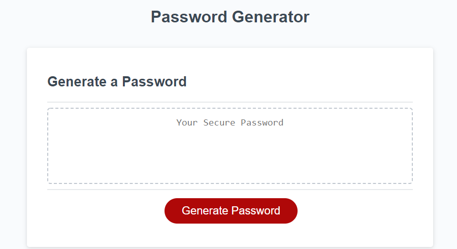
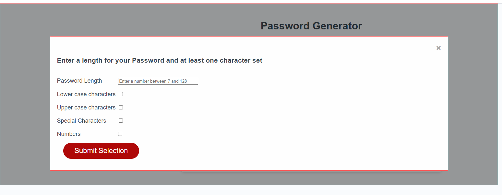
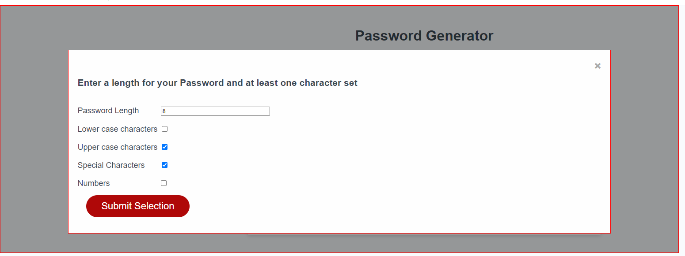
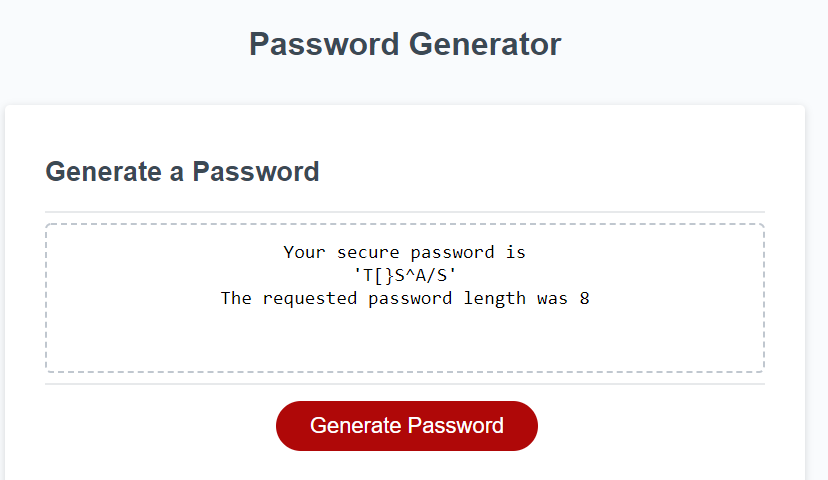

Generate Password Modal
This application generates a Random Password using a Modal structure
This module generates a random password based on selection criteria entered by a user.

The user is able to chose a number of character sets to include and a password length between 8 and 128. 
For each character set selection it is written to a string and the random password is generated on this string. 

This will produce a more random password.

**Link**

The link to the deployed application is : https://susanne85.github.io/generatePasswordModal/

Initial page display

Modal Page allows the user to enter the length of the random password to be generated and the charactersets to include within the one action.

The final pages shows the random generated password and the requested password length.

Display for including numbers in the generated password.
